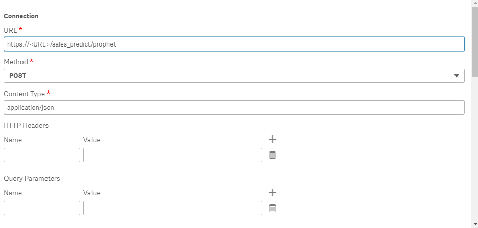
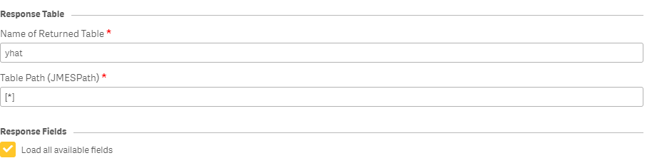

# Install Python Sales Predictions

## Activate virtual environment

```bash
python -m venv venv
source venv/bin/activate
```

## Install requirements

```bash
pip install -r requirements.txt
```

## Launch dev project

```bash
uvicorn app:app --reload
```

## Launch prod project with docker

```bash
docker build -t sales_predict .
docker run --rm -ti -p 8484:8484 sales_predict
```

## Authentification

### Create application with auth0

You need to create an Regular Web Application into auth0.
Setting and Environnement variable with .env file

```python
# .env

AUTH0_DOMAIN = your.domain.auth0.com
AUTH0_API_AUDIENCE = https://your.api.audience
AUTH0_ISSUER = https://your.domain.auth0.com/
AUTH0_ALGORITHMS = RS256
```

If you forget information about the audiance, check this video.
[https://community.auth0.com/t/what-is-the-audience/71414](https://community.auth0.com/t/what-is-the-audience/71414)

Get a token with this curl command

```curl
curl -X 'POST' \
--url 'https://qfp.eu.auth0.com/oauth/token' \
 --header 'content-type: application/x-www-form-urlencoded' \
 --data 'grant_type=client_credentials' \
 --data 'client_id=<CLIENT_ID>' \
 --data 'client_secret=<CLIENT_SECRET>' \
 --data 'audience=audience.api'
 ```

Test a private access with this

```curl
curl -X 'GET'   'http://localhost:8000/'   -H 'accept: application/json' \
  -H 'Authorization: Bearer <TOKEN>
```

## Qlik Sense Configuration

You need to use a Advanced Analytics Connector for predict Sales Future revenue.

Please read [Advanced Analytic analytics source](https://help.qlik.com/en-US/cloud-services/Subsystems/Hub/Content/Sense_Hub/LoadData/ac-advanced-analytic-overview.htm)

[Creating an Advanced Analytic connection](https://help.qlik.com/en-US/cloud-services/Subsystems/Hub/Content/Sense_Hub/LoadData/ac-advanced-analytic-create.htm)

Example about Advanced Analytics Connection for this Script.





Response Table:

**Table Fields (JMESPath)**: The Table fields can be specified by adding:
    Name: the name of the table that will be loaded in the app.
    Value: the name of the response row in the JSON response array.
JMESPath query language can be used to parse the JSON response array.
